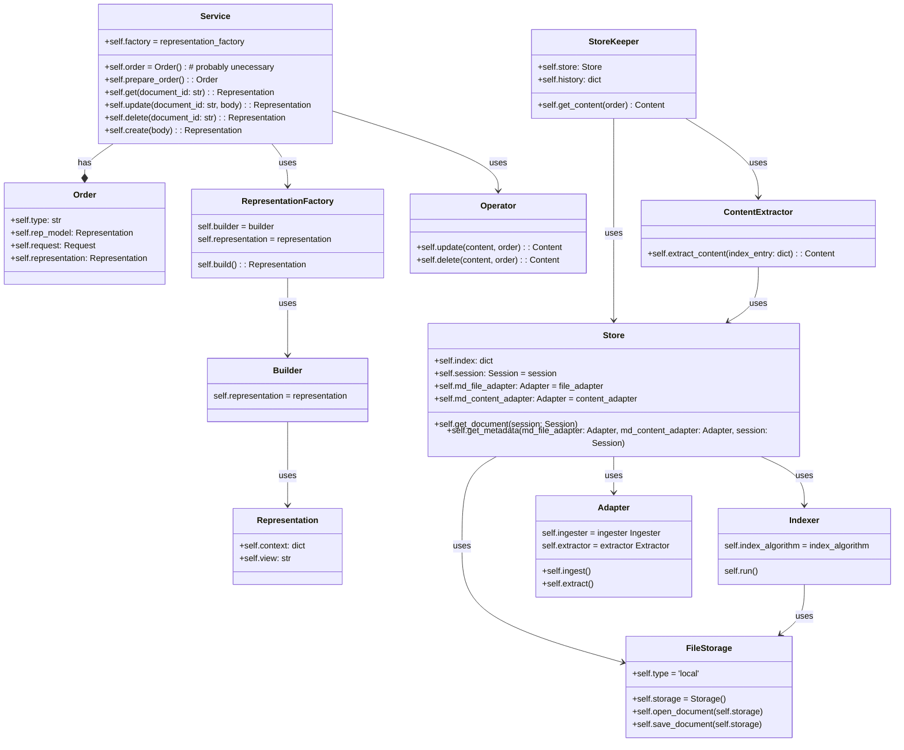
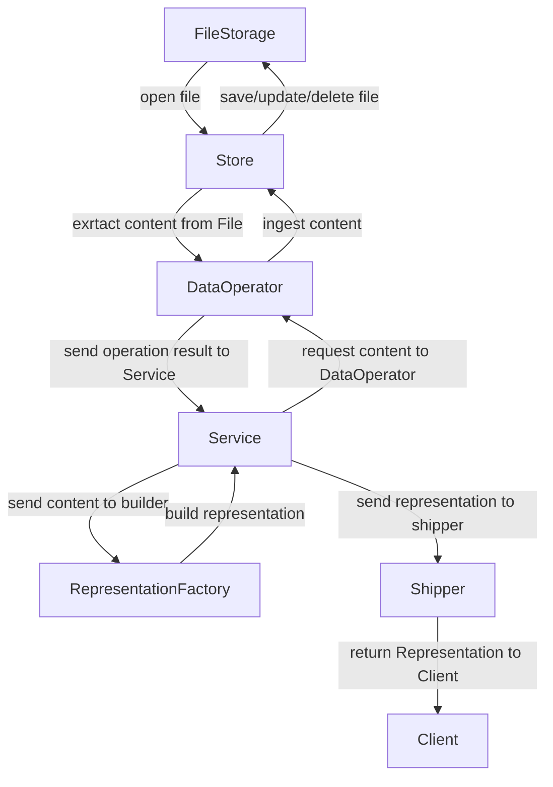
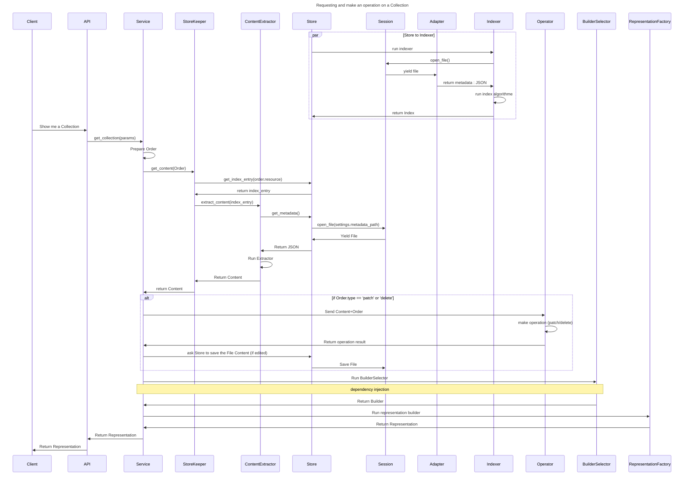
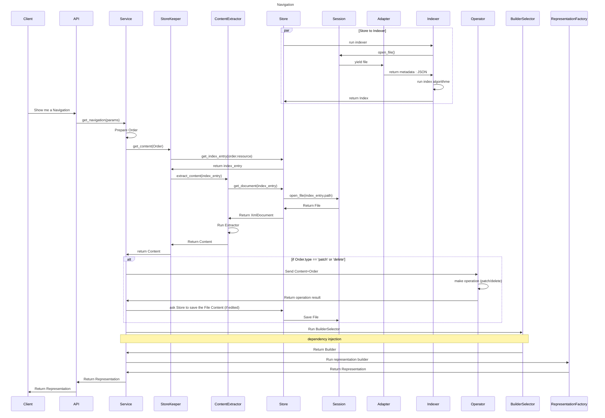

```mermaid
classDiagram
    
    class Order
    class Service{
        +self.order = Order() # probably unecessary
        +self.factory = representation_factory
        +self.prepare_order() : Order
        +self.get(document_id: str) : Representation
        +self.update(document_id: str, body) : Representation
        +self.delete(document_id: str) : Representation
        +self.create(body) : Representation
    }
    class Adapter{
        self.ingester = ingester Ingester
        self.extractor = extractor Extractor
        +self.ingest()
        +self.extract()
    }
    class Operator{
        +self.update(content, order) : Content
        +self.delete(content, order) : Content
    }
    class Representation{
        +self.context: dict
        +self.view: str
    }
    class RepresentationFactory{
        self.builder = builder
        self.representation = representation
        self.build() : Representation
    }
    class Builder{
        self.representation = representation
    }
    class Indexer{
        self.index_algorithm = index_algorithm
        self.run()
    }
    class FileStorage{
        +self.type = 'local'
        +self.storage = Storage()
        +self.open_document(self.storage)
        +self.save_document(self.storage)
    }
    class Store {
        +self.index: dict 
        +self.session: Session = session
        +self.md_file_adapter: Adapter = file_adapter
        +self.md_content_adapter: Adapter = content_adapter
        +self.get_document(session: Session)
        +self.get_metadata(md_file_adapter: Adapter, md_content_adapter: Adapter, session: Session)
    }
    class StoreKeeper{
        +self.store: Store
        +self.history: dict
        +self.get_content(order) Content
    }
    class ContentExtractor{
        +self.extract_content(index_entry: dict) : Content
    }
    class Order{
        +self.type: str
        +self.rep_model: Representation
        +self.request: Request
        +self.representation: Representation
    }
    StoreKeeper --> Store : uses
    StoreKeeper --> ContentExtractor : uses
    Store --> FileStorage : uses
    Store --> Adapter : uses
    Store --> Indexer : uses
    Indexer --> FileStorage : uses
    ContentExtractor --> Store : uses
    Service --* Order : has
    Service --> RepresentationFactory : uses
    Service --> Operator : uses
    Builder --> Representation : uses
    RepresentationFactory --> Builder : uses
```

```mermaid
flowchart
    FileStorage -- open file --> Store
    Store -- save/update/delete file --> FileStorage
    Store -- exrtact content from File --> DataOperator
    DataOperator -- ingest content --> Store
    DataOperator -- send operation result to Service --> Service
    Service -- request content to DataOperator --> DataOperator
    Service -- send content to builder --> RepresentationFactory
    RepresentationFactory -- build representation --> Service
    Service -- send representation to shipper --> Shipper
    Shipper -- return Representation to Client --> Client
    
```

```mermaid
---
title: Requesting and make an operation on a Collection
---
sequenceDiagram
    participant Client
    participant API
    participant Service
    participant StoreKeeper
    participant ContentExtractor
    participant Store
    participant Session
    participant Adapter
    participant Indexer
    participant Operator
    participant BuilderSelector
    participant RepresentationFactory
    par Store to Indexer
        Store->>Indexer: run indexer
        Indexer->>Session: open_file()
        Session->>Adapter: yield file
        Adapter->>Indexer: return metadata : JSON
        Indexer->>Indexer: run index algorithme
        Indexer->>Store: return Index
    end
    Client->>API: Show me a Collection
    API->>Service: get_collection(params)
    Service->>Service : Prepare Order
    Service->>StoreKeeper: get_content(Order)
    StoreKeeper->>Store: get_index_entry(order.resource)
    Store->>StoreKeeper: return index_entry
    StoreKeeper->>ContentExtractor: extract_content(index_entry)
    ContentExtractor->>Store: get_metadata()
    Store->>Session: open_file(settings.metadata_path)
    Session->>Store: Yield File
    Store->>ContentExtractor: Return JSON
    ContentExtractor->>ContentExtractor: Run Extractor
    ContentExtractor->>StoreKeeper: Return Content
    StoreKeeper->>Service: return Content
    alt if Order.type == 'patch' or 'delete'
    Service->>Operator: Send Content+Order
    Operator->>Operator: make operation (patch/delete)
    Operator->>Service: Return operation result
    Service->>Store: ask Store to save the File Content (if edited)
    Store->>Session: Save File
    end
        Service->>BuilderSelector: Run BuilderSelector
    Note over Service,BuilderSelector: dependency injection
    BuilderSelector->>Service: Return Builder
    Service->>RepresentationFactory: Run representation builder
    RepresentationFactory->>Service: Return Representation
    Service->>API: Return Representation
    API->>Client: Return Representation
```

```mermaid
---
title: Navigation
---
sequenceDiagram
    participant Client
    participant API
    participant Service
    participant StoreKeeper
    participant ContentExtractor
    participant Store
    participant Session
    participant Adapter
    participant Indexer
    participant Operator
    participant BuilderSelector
    participant RepresentationFactory
    par Store to Indexer
        Store->>Indexer: run indexer
        Indexer->>Session: open_file()
        Session->>Adapter: yield file
        Adapter->>Indexer: return metadata : JSON
        Indexer->>Indexer: run index algorithme
        Indexer->>Store: return Index
    end
    Client->>API: Show me a Navigation
    API->>Service: get_navigation(params)
    Service->>Service : Prepare Order
    Service->>StoreKeeper: get_content(Order)
    StoreKeeper->>Store: get_index_entry(order.resource)
    Store->>StoreKeeper: return index_entry
    StoreKeeper->>ContentExtractor: extract_content(index_entry)
    ContentExtractor->>Store: get_document(index_entry)
    Store->>Session: open_file(index_entry.path)
    Session->>Store: Return File
    Store->>ContentExtractor: Return XmlDocument
    ContentExtractor->>ContentExtractor: Run Extractor
    ContentExtractor->>StoreKeeper: Return Content
    StoreKeeper->>Service: return Content
    # Store->>Service: Return Order
    # Store->>Adapter: Run conversion
    # Adapter->>Store: Return JSON
    # Store->>Service: Return File Content
    alt if Order.type == 'patch' or 'delete'
    Service->>Operator: Send Content+Order
    Operator->>Operator: make operation (patch/delete)
    Operator->>Service: Return operation result

    Service->>Store: ask Store to save the File Content (if edited)
    Store->>Session: Save File
    end
    Service->>BuilderSelector: Run BuilderSelector
    Note over Service,BuilderSelector: dependency injection
    BuilderSelector->>Service: Return Builder
    Service->>RepresentationFactory: Run representation builder
    RepresentationFactory->>Service: Return Representation
    Service->>API: Return Representation
    API->>Client: Return Representation
```